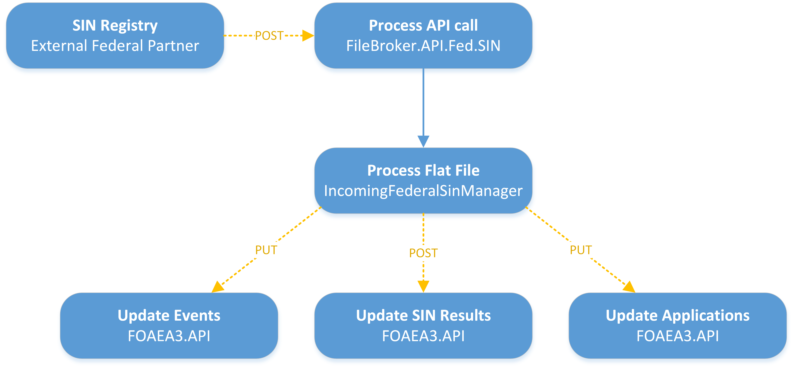

# Processing Federal SIN Files
The following processes uses the same files currently being exchanged with the SIN Registry, in the same format. Future updates may add different formats or allow individual requests rather than the current batch system.
## Incoming Federal SIN Files
1.	External partner calls our API to send us their file: 

    `POST http://{server}:14015/api/v1/SinFiles?fileName=HR3SVSIS.{nnn}`

    * **Important:** The **body** of the API must contain the flatfile we currently receive, as text.
    * `{server}` will be our server name available to external users
    * `{nnn}` will be the next sequence that we are expecting (e.g. 123)
The `ProcessSINFile()` method of the `SinFilesController` class found in the `Incoming.API.Fed.SIN` project is called via that API.
2.	`ProcessSINFile()` will call the `ProcessFlatFile()` method of the `IncomingFederalSinManager` class found in the `FileBroker.Business` project. `ProcessFlatFile()` will load the flat file, extract it’s data, and call APIs to update the FOAEA system with the new data:
    1.	Set the File Loading flag in the `FileTable` in the Message Broker database
    2.	Extract the flat file data
    3.	Validate the flat file data
    4.	Extract business data from the flat file
    5.	Send the SIN results to the FOAEA database by called FOAEA APIs:
        1.	Update the SIN Events and Event Details tables
        2.	Update the SIN Results table
        3.	Update the applications based on the SIN results (either the SIN was confirmed or it was not – the state of the matching application will change to 6 if it was confirmed or to 5 if it was not).
    6.	Change the cycle to the next increment expected
    7.	Reset the File Loading flag in the `FileTable` in the Message Broker database

   